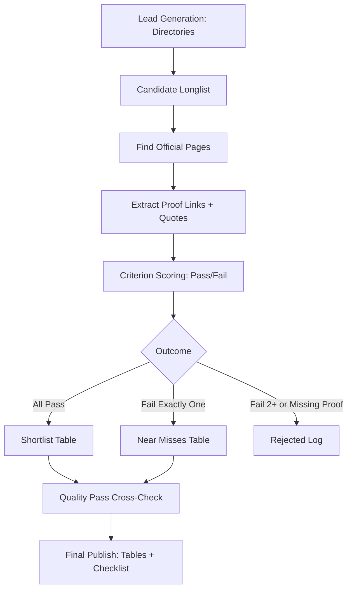

# Scholars - Auditable Scholarship Shortlist System (2026 Intake)

A strict, one-time, auditable scholarship research system for producing a verified shortlist of fully-funded undergraduate scholarships for a Zimbabwean applicant targeting 2026 intake.

## Overview

This system implements a "courtroom standard" approach to scholarship research:
- **Proof-first**: Every criterion requires official source URLs and exact quotes
- **Auditable**: All pass/fail decisions are traceable to specific evidence
- **Strict filtering**: 10 mandatory criteria (C1-C10) must all pass for shortlisting

## Target Applicant Profile

- **Nationality**: Zimbabwe
- **Qualifications**: ZIMSEC O-level + Cambridge A-level
- **Target Degree**: Undergraduate/Bachelor in STEM (Electrical Engineering preferred)
- **Intake**: 2026
- **Constraints**: No SAT, IELTS/TOEFL waiver needed (Medium of Instruction acceptable)

## Criteria Summary (C1-C10)

| Code | Criterion | Pass Condition |
|------|-----------|----------------|
| C1 | Nationality | Zimbabwe explicitly accepted or "international students" eligible |
| C2 | Degree Level | Undergraduate/Bachelor explicitly stated |
| C3 | Tuition | Full tuition coverage explicitly stated |
| C4 | Accommodation | Housing/accommodation allowance explicitly stated |
| C5 | Stipend | Living allowance/stipend explicitly stated |
| C6 | STEM/EE | STEM programs allowed, EE not excluded (ideally EE explicit) |
| C7 | Deadline | Specific date after 2026-01-15 for 2026 intake |
| C8 | SAT | "Not required" or no SAT requirement stated |
| C9 | IELTS/TOEFL | Not required OR explicit waiver route (e.g., MOI letter) |
| C10 | Not Embassy | University/institution administered, not embassy-run |

## Project Structure

```
scholars/
├── README.md                           # This file
├── docs/
│   ├── filtering-logic.md              # Detailed C1-C10 criteria definitions
│   ├── research-workflow.md            # Step-by-step research process
│   └── search-strategy.md              # Targeted search queries
├── templates/
│   ├── data-capture-template.csv       # Main auditable data capture
│   ├── shortlist-output.md             # Final shortlist format
│   ├── near-misses-output.md           # Near-miss scholarships format
│   └── application-checklist.md        # Per-scholarship application steps
├── data/
│   ├── longlist.csv                    # Initial candidate scholarships
│   ├── scored.csv                      # Scored with pass/fail flags
│   ├── shortlist.csv                   # Final shortlist (all pass)
│   ├── near-misses.csv                 # Fails exactly one criterion
│   └── rejected.csv                    # Fails 2+ or missing proof
└── output/
    ├── final-shortlist.md              # Published shortlist table
    ├── near-misses-report.md           # Near-miss analysis
    └── application-checklists/         # Per-scholarship checklists
```

## Workflow Summary



## Exclusions

- Scholarships administered by embassies/foreign missions
- Scholarships requiring SAT (with no waiver)
- Scholarships requiring IELTS/TOEFL (with no waiver route for English-medium instruction)
- Graduate/postgraduate scholarships
- Region-restricted scholarships that exclude Zimbabwe

## Known Risks

The criteria combination is extremely restrictive:
- Full ride (tuition + accommodation + stipend)
- Undergraduate level
- Zimbabwe accepted
- No SAT required
- No IELTS/TOEFL or explicit waiver
- Deadline after 2026-01-15

**A very small or even empty strict shortlist is possible.**

Mitigation: The near-misses table is maintained with high quality so the applicant can decide which single criterion to relax.

## Usage

1. Review `docs/filtering-logic.md` for detailed criteria definitions
2. Follow `docs/research-workflow.md` for the research process
3. Use `templates/data-capture-template.csv` to record findings
4. Score each scholarship against C1-C10
5. Generate outputs in `output/` directory

## License

This project is for personal educational research purposes.
