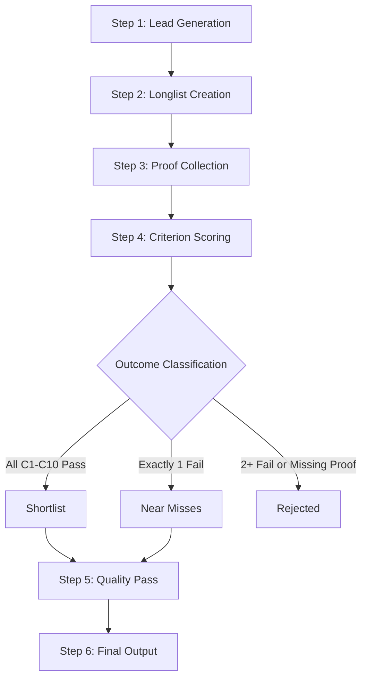

# Research Workflow - One-Time Reproducible Process

This document outlines the step-by-step process for generating the auditable scholarship shortlist.

## Workflow Diagram



---

## Step 1: Lead Generation (Directories as Lead Sources Only)

### Purpose
Discover potential scholarship candidates from reputable sources. These are LEADS only - all verification must come from official pages.

### Primary Lead Sources

#### University Scholarship Pages (Best Source)
- Direct university international scholarship pages
- University financial aid offices
- Faculty/department-specific scholarships

#### Aggregator Databases (Lead Generation Only)
- ScholarshipsAds.com
- StudyPortals.com
- TopUniversities.com
- DAAD Scholarship Database
- Study Abroad portals

#### National Admissions Portals
- UCAS (UK)
- Common App international (US - limited due to SAT)
- UniAssist (Germany)
- Campus France
- Studyinholland.nl

### Lead Capture Format
For each lead, capture:
```
Lead ID: [Sequential number]
Scholarship Name: [As found]
University/Institution: [Name]
Country: [Country]
Source URL: [Where you found this lead]
Date Found: [YYYY-MM-DD]
Initial Notes: [Why this looks promising]
Status: [Pending Review]
```

---

## Step 2: Longlist Creation Rules (High Recall)

### Inclusion Criteria (Generous)
Include candidates that APPEAR to be:
- [ ] Undergraduate/bachelor scholarships
- [ ] For international students (not just domestic)
- [ ] Full funding or "fully funded" language
- [ ] STEM-friendly or all fields
- [ ] 2026 intake likely (or 2025 with annual renewal pattern)

### Exclusion at Longlist Stage
DO NOT exclude yet based on:
- SAT requirements (check for waivers)
- English testing requirements (check for waivers)
- Unclear deadline (may be announced later)

### DO Exclude at Longlist Stage
- Clearly graduate/postgraduate only
- Clearly domestic students only
- Clearly embassy-administered
- Expired with no renewal pattern

### Longlist Entry Format
Use `templates/data-capture-template.csv` with initial fields populated.

---

## Step 3: Proof Collection (Official Pages Only)

### Required URLs per Scholarship
For each longlist candidate, collect these official URLs:

| URL Type | Purpose | Criterion |
|----------|---------|-----------|
| Eligibility URL | Nationality requirements | C1 |
| Degree Level URL | Undergraduate confirmation | C2 |
| Benefits URL | Tuition, accommodation, stipend | C3, C4, C5 |
| Fields/Majors URL | STEM/EE eligibility | C6 |
| Deadline URL | Specific date for 2026 | C7 |
| SAT Policy URL | SAT not required | C8 |
| English Policy URL | IELTS/TOEFL waiver | C9 |
| Application URL | Portal, administrator | C10 |

### Search Strategy per URL Type

```bash
# Eligibility
"[scholarship name]" site:[university-domain] eligibility international

# Degree level
"[scholarship name]" site:[university-domain] undergraduate bachelor

# Benefits
site:[university-domain] "[scholarship name]" benefits stipend accommodation

# Fields
site:[university-domain] "[scholarship name]" eligible majors programs engineering

# Deadline
site:[university-domain] "[scholarship name]" deadline 2026 application

# SAT
site:[university-domain] SAT required OR "standardized tests" admission requirements

# English
site:[university-domain] IELTS TOEFL required waiver "English proficiency"

# Application
site:[university-domain] "[scholarship name]" apply application portal
```

### Evidence Snippet Format
For each URL, extract:
```
URL: [Full official URL]
Quote: "[Exact text, 1-3 sentences]"
Page Title: [Browser tab title]
Access Date: [YYYY-MM-DD HH:MM UTC]
Screenshot: [Optional: filename if saved]
```

### Missing Proof Handling
If a required URL cannot be found after 15 minutes of searching:
1. Mark criterion as "MISSING PROOF"
2. Document search attempts
3. Classify as FAIL for that criterion

---

## Step 4: Criterion Scoring

### Process
For each longlist entry with collected proof:

1. Open `docs/filtering-logic.md`
2. Evaluate each criterion C1-C10 against the evidence
3. Mark PASS, FAIL, or MISSING for each
4. Record the determining quote

### Scoring Table Format

| Criterion | Status | URL | Quote | Notes |
|-----------|--------|-----|-------|-------|
| C1 Nationality | PASS/FAIL/MISSING | [URL] | "[Quote]" | |
| C2 Undergraduate | PASS/FAIL/MISSING | [URL] | "[Quote]" | |
| C3 Tuition | PASS/FAIL/MISSING | [URL] | "[Quote]" | |
| C4 Accommodation | PASS/FAIL/MISSING | [URL] | "[Quote]" | |
| C5 Stipend | PASS/FAIL/MISSING | [URL] | "[Quote]" | |
| C6 STEM/EE | PASS/FAIL/MISSING | [URL] | "[Quote]" | |
| C7 Deadline | PASS/FAIL/MISSING | [URL] | "[Quote]" | |
| C8 SAT | PASS/FAIL/MISSING | [URL] | "[Quote]" | |
| C9 IELTS/TOEFL | PASS/FAIL/MISSING | [URL] | "[Quote]" | |
| C10 Not Embassy | PASS/FAIL/MISSING | [URL] | "[Quote]" | |

### Classification

| Pass Count | Fail Count | Classification |
|------------|------------|----------------|
| 10 | 0 | **SHORTLIST** |
| 9 | 1 | **NEAR MISS** |
| 0-8 | 2+ | **REJECTED** |

---

## Step 5: Quality Pass (Verification)

### For Every Shortlisted Item, Verify:

#### 5.1 Deadline Stability
- [ ] Date appears on stable official page (not a news post)
- [ ] Page is clearly for 2026 intake
- [ ] Date is unambiguous (day/month/year format clear)

#### 5.2 Benefits Completeness
- [ ] Tuition coverage is on official benefits page
- [ ] Accommodation is explicitly mentioned (not assumed)
- [ ] Stipend amount or "living allowance" is stated

#### 5.3 Testing Clarity
- [ ] No hidden "standardized tests required" elsewhere
- [ ] SAT waiver applies to this scholarship specifically
- [ ] English waiver route is clearly available

#### 5.4 Application Route
- [ ] Application is via university/institution portal
- [ ] No embassy nomination required
- [ ] Direct application process confirmed

#### 5.5 Cross-Reference Check
- [ ] Check university news for any policy changes
- [ ] Verify scholarship still active for 2026
- [ ] Confirm no recent eligibility changes

### Quality Pass Failures
If quality pass reveals issues:
1. Reclassify to NEAR MISS or REJECTED
2. Document the issue found
3. Update scoring table

---

## Step 6: Final Output Generation

### Output Files

#### 1. Shortlist Table (`output/final-shortlist.md`)
All scholarships with C1-C10 PASS
- Use format from `templates/shortlist-output.md`

#### 2. Near Misses Report (`output/near-misses-report.md`)
All scholarships with exactly 1 FAIL
- Use format from `templates/near-misses-output.md`
- Include which criterion failed and why

#### 3. Application Checklists (`output/application-checklists/`)
One file per shortlisted scholarship
- Use format from `templates/application-checklist.md`

#### 4. Rejected Log (`data/rejected.csv`)
All scholarships with 2+ FAIL or missing proof
- Brief reason for rejection

---

## Timeline Estimates

| Step | Estimated Time |
|------|----------------|
| Lead Generation | 2-4 hours |
| Longlist Creation | 1-2 hours |
| Proof Collection (per scholarship) | 30-60 minutes |
| Scoring (per scholarship) | 15-30 minutes |
| Quality Pass (per shortlisted) | 15-30 minutes |
| Output Generation | 1-2 hours |

**Total for 50 leads**: 20-40 hours

---

## Research Log Template

Maintain a research log for reproducibility:

```
=== Research Session ===
Date: YYYY-MM-DD
Time: HH:MM - HH:MM UTC
Scholarships Reviewed: [List]
Outcomes:
  - Shortlisted: [Count]
  - Near Miss: [Count]
  - Rejected: [Count]
Notes: [Any issues encountered]
Next Steps: [What to do next session]
```
